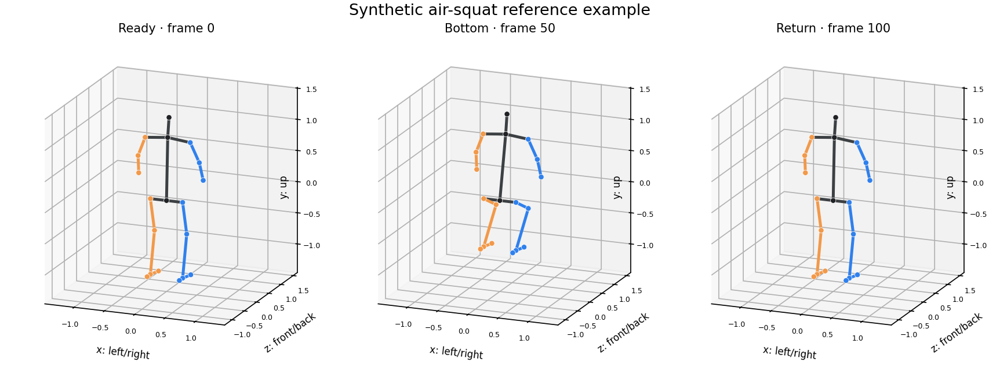

# AI Trainer

소재부품융합공학과 졸업프로젝트 5조 — 웹캠으로 에어스쿼트 자세를 분석하고 정상 동작 레퍼런스와 비교하는 프로젝트입니다.

## 실시간 카메라 · 3D 스켈레톤

노트북 카메라 영상을 한 창의 왼쪽에 표시하면서 2D 관절을 겹쳐 그리고, 같은 프레임에서 MediaPipe가 추정한 33개 world landmark를 오른쪽 3D 스켈레톤으로 표시합니다. 카메라 처리는 별도 스레드에서 실행되며 영상 프레임을 파일로 저장하지 않습니다.

처음 한 번 의존성과 공식 MediaPipe lite 모델을 준비합니다.

```powershell
python -m pip install -r requirements.txt
python scripts/download_pose_model.py
```

실행:

```powershell
python scripts/run_live_pose.py
```

VS Code에서는 **Run and Debug**에서 `Python: 실시간 카메라 3D 스켈레톤`을 선택하고 `F5`를 누릅니다. 다른 카메라를 사용하려면 터미널에서 인덱스를 지정합니다.

```powershell
python scripts/run_live_pose.py --camera 1
```

표시되는 3D 좌표는 깊이 카메라의 실측값이 아니라 단일 RGB 영상에서 추정한, 골반 중앙 원점의 좌표입니다. 안정적인 전신 추론을 위해 밝은 장소에서 카메라와 2–3 m 거리를 두는 것을 권장합니다.

## 에어스쿼트 reference data

AI Hub의 [크로스핏 동작 데이터(71422)](https://www.aihub.or.kr/aihubdata/data/view.do?dataSetSn=71422) 중 `에어 스쿼트 / 정상` 3D 스켈레톤만 골라 다음 처리를 수행하는 빌더가 준비되어 있습니다.

Python 또는 VS Code의 실행 버튼으로 바로 확인하려면 다음 명령만 실행합니다.

```powershell
python main.py
```

`data/raw/aihub_crossfit/`에 AI Hub JSON·CSV가 있으면 실제 reference를 빌드하고, 아직 없으면 안전한 합성 스켈레톤 예시를 `data/reference/demo/reference_preview.png`로 생성합니다.

VS Code에서는 **Run and Debug**에서 `Python: 스켈레톤 예시 실행`을 선택하고 `F5`를 누르면 됩니다. 실제 다운로드 데이터를 처리할 때는 `Python: AI Hub reference 빌드` 구성을 선택합니다.

```text
정상 라벨 선별 → 3D 관절 파싱 → 골반 중심화 → 체형·방향 정규화
→ 반복 동작 분할 → 하강/최저점/상승 101-point 정렬 → robust reference 생성
```

AI Hub 원본·샘플 데이터는 로그인과 다운로드 신청이 필요하며 현재 저장소에는 포함되어 있지 않습니다. 따라서 임의 좌표를 reference로 넣지 않았습니다. 전체 데이터는 약 1.44 TB이지만 영상은 필요하지 않습니다. 승인 후 파일 목록에서 아래 라벨링 ZIP만 선택해 `data/raw/aihub_crossfit/`에 압축 해제합니다.

- `Training/02.라벨링데이터/TL.zip` — 3,136,220,431 bytes
- `Validation/02.라벨링데이터/VL.zip` — 386,509,510 bytes

```powershell
python scripts/build_air_squat_reference.py `
  --input data/raw/aihub_crossfit `
  --output data/reference/air_squat
```

파일 구조 때문에 자동 매칭이 모호하면 명시적 manifest를 사용합니다.

```powershell
Copy-Item configs/aihub_air_squat_pairs.example.csv data/raw/aihub_crossfit/pairs.csv
# pairs.csv의 두 경로를 실제 압축 해제 경로에 맞게 수정
python scripts/build_air_squat_reference.py `
  --input data/raw/aihub_crossfit `
  --pairs-manifest data/raw/aihub_crossfit/pairs.csv `
  --output data/reference/air_squat
```

결과는 `reference.npz`, `repetitions.npz`, `reference_preview.png`, `manifest.csv`, `metadata.json`, `build_report.json`입니다. `reference_preview.png`에는 정규화된 중앙값 스켈레톤의 준비·최저점·복귀 자세가 3D로 표시됩니다. 자세한 스키마와 품질 기준은 [reference data 문서](docs/reference_data.md)를 참고하세요.

### AI Hub `.part` 파일 처리 (Windows / Python)

AI Hub API가 만든 `파일명.tar.part<숫자>`의 숫자는 파트 번호가 아니라 원본 파일의 **byte offset**입니다. 따라서 문자열순으로 합치면 안 됩니다. 다음 Python 도구는 offset 연속성, TAR 시작 헤더와 종료 블록을 먼저 검사합니다.

```powershell
python scripts/process_aihub_parts.py `
  --parts "C:\path\to\rawdata" `
  --verify

# 합본 파일을 만들지 않고 앞쪽 member만 확인
python scripts/process_aihub_parts.py `
  --parts "C:\path\to\rawdata" `
  --list 20
```

TAR는 중간 합본을 만들지 않고 곧바로 안전하게 풀 수 있습니다. 대상은 새 빈 디렉터리를 사용합니다.

```powershell
python scripts/process_aihub_parts.py `
  --parts "C:\path\to\rawdata" `
  --extract "D:\AIHub\rawdata_extracted"
```

ZIP 조각은 먼저 병합한 뒤 압축을 풉니다. 병합에는 원본 ZIP 크기만큼의 추가 여유 공간이 필요합니다.

```powershell
python scripts/process_aihub_parts.py `
  --parts "C:\path\to\labeling" `
  --merge "D:\AIHub\TL.zip"
```

`body_01.tar` 같은 `rawdata`에는 JPG 원천 프레임만 있으므로 이를 풀어도 현재 reference 빌더의 입력이 되지 않습니다. 정상 에어스쿼트 annotation JSON과 3D keypoint CSV가 든 **라벨링 데이터(TL/VL)** 를 받아 압축 해제한 경로를 `--input`으로 지정해야 합니다.



테스트 실행:

```powershell
python -m unittest discover -s tests -v
```

> AI Hub 원본과 파생 reference는 저장소에 커밋하지 않습니다. 결과물에도 과학기술정보통신부·한국지능정보사회진흥원 AI Hub 사업결과 활용 사실을 표시해야 하며, 제3자 제공 등은 [AI Hub 이용정책](https://www.aihub.or.kr/intrcn/guid/usagepolicy.do?currMenu=151&topMenu=105)을 따라야 합니다.
